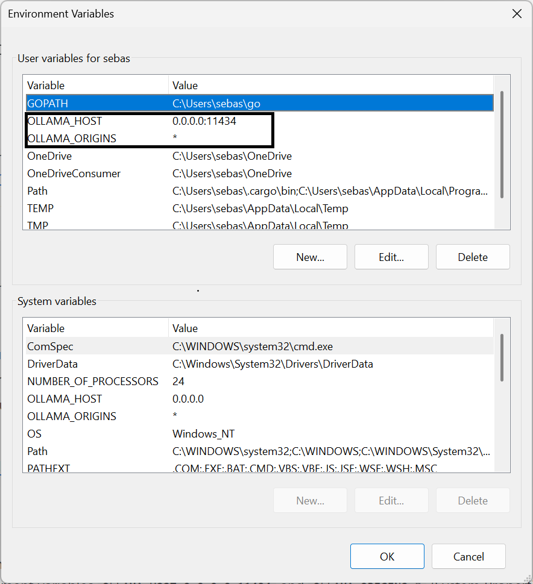

# Deskdrop

Deskdrop is an Android keyboard with AI built in. Use Ollama, any OpenAI-compatible server, or a cloud API key. Built on HeliBoard.

## Demo

**AI Toner** - Rewrite selected text with one tap. All buttons are fully configurable in settings.

https://github.com/user-attachments/assets/635d2ac9-3637-4e7c-8e4c-513b09e0f57f

**Clipboard AI** - Process clipboard content through AI

https://github.com/user-attachments/assets/3f13accb-59d9-4568-9e50-cf3405665bd4

More demos

**Inline // syntax** - Type instructions directly after your text

https://github.com/user-attachments/assets/9aed41b8-5524-41ef-9fa7-33618d7fcd84

**Conversation + Tools** - Ask about the weather, it calls the tool automatically

https://github.com/user-attachments/assets/0aabddb6-1162-40e5-a43c-ae75edd0239c

**Calendar** - Create appointments through natural language

https://github.com/user-attachments/assets/1827cb16-48af-412b-a9a3-d87413f054cb

**MCP (Home Assistant)** - Control your smart home from your keyboard

https://github.com/user-attachments/assets/5d807877-a171-4389-a132-8fe65f53ee20

## Why Deskdrop

- **Your backend, your choice.** Ollama, LM Studio, vLLM, llama.cpp, KoboldCpp, or a cloud API key (Groq, Gemini, OpenRouter, Anthropic, OpenAI).
- **Built for self-hosted setups.** MCP support for Home Assistant and custom tool servers. Primary plus LAN/Tailscale fallback URL.
- **Built on HeliBoard.** Themes, layouts, dictionaries, clipboard history, glide typing, one-handed mode, split keyboard. All preserved.
- **No telemetry. No analytics.** Password fields blocked. API keys encrypted (AES-256-GCM). Clipboard and device actions opt-in.
- **Use it where you already type.** Toolbar buttons, inline `//` commands, voice, home-screen widget, Quick Settings tile, share sheet, Android text selection menu.

## Features

**Local AI integration**
- Ollama, LM Studio, vLLM, llama.cpp, KoboldCpp, Jan, Msty, or any OpenAI-compatible server
- Primary + LAN fallback URL for seamless connectivity
- On-device ONNX inference (T5) for fully offline use
- Ollama Model Wizard: create custom models with tailored system prompts

**Cloud providers**
- Gemini, Groq, OpenRouter, Anthropic, OpenAI
- Cloud fallback: when your local server goes down, all shortcuts automatically switch to a cloud model and revert when it's back (red dot indicator on toolbar keys)

**AI shortcuts**
- AI Assist: rewrite, translate, or transform selected text with a single tap
- AI Tone: one-tap tone adjustment (Formal, Casual, Friendly, Shorter, Longer, Grammar, Dutch, English) with customizable chips
- AI Preview Panel: see results before applying, with retry, copy, and dismiss options
- 4 configurable shortcut slots, each with its own model and instruction
- Inline commands with `//` syntax (e.g. `//formal`, `//grammar`, `//shorten`) with command chaining
- Clipboard context: copy a message, type your reply, AI uses the context automatically
- AI Clipboard: process clipboard content through AI
- Undo: tap again after AI processing to restore original text

**Voice**
- Self-hosted Whisper transcription (via Speaches or any Whisper-compatible server)
- Google Speech Recognition as alternative engine
- Configurable voice modes with custom prompts
- Supports `{voice_input}` and `{clipboard}` placeholders

**Conversation**
- Full multi-turn chat interface
- Model picker per conversation
- Reminder system with notifications that reopen the exact conversation

**17 built-in AI tools**

| Tool | What it does |
|---|---|
| `calculator` | Evaluate arithmetic expressions |
| `get_datetime` | Current date, time, timezone |
| `unit_convert` | Convert between units (length, mass, temperature, etc.) |
| `battery_info` | Battery percentage and charging state |
| `device_info` | Phone model, Android version, free storage |
| `read_clipboard` | Read clipboard contents |
| `fetch_url` | Fetch and read a web page |
| `web_search` | Search via Brave/Tavily |
| `weather` | Current weather via wttr.in |
| `set_timer` | Start a countdown timer |
| `open_app` | Launch an app by name |
| `set_reminder` | Schedule a notification reminder |
| `calendar` | Read, add, update, delete calendar events |
| `navigate` | Open turn-by-turn navigation |
| `phone_call` | Open dialer with number |
| `send_sms` | Open SMS app with message |
| `contact_lookup` | Search contacts by name |

**MCP (Model Context Protocol)**
- Connect external tool servers (Home Assistant, filesystem, custom APIs)
- Streamable HTTP and Legacy SSE transport
- Per-server bearer token authentication

**Home screen widget**
- Quick access bar with Voice, Chat, and Execute buttons

## Getting started

Install the APK, open Deskdrop, and the setup wizard walks you through everything.

### Quick Start

1. Install the APK and open Deskdrop
2. Tap **Try it now**
3. Choose **Quick Start**
4. Turn on Deskdrop in your keyboard settings
5. Switch to Deskdrop as your active keyboard
6. Get a free API key from [Groq](https://console.groq.com/keys) and paste it ([watch guide](https://github.com/SvReenen/Deskdrop/releases/download/v1.3/onboarding_groq_guide_video.mp4))
7. Done. You can start using AI right away

### Advanced Setup

Choose **Advanced Setup** if you want to connect your own models or use a specific cloud provider.

**Cloud path (Groq / Gemini)**

1. Choose **Cloud** on the setup screen
2. Get a free API key from Groq or Gemini
3. Paste your key and continue
4. The AI demo lets you test your connection before finishing

[Watch the Groq setup guide (1 min)](https://github.com/SvReenen/Deskdrop/releases/download/v1.3/onboarding_groq_guide_video.mp4)

**Local path (Ollama)**

1. Make sure Ollama is running on your computer
2. Set Ollama to accept connections from your phone:
   - Windows: set environment variables `OLLAMA_HOST=0.0.0.0:11434` and `OLLAMA_ORIGINS=*` (System Properties > Environment Variables), then restart Ollama
   - Mac/Linux: `OLLAMA_HOST=0.0.0.0 OLLAMA_ORIGINS=* ollama serve`

   

   
Windows environment variables example

   

   

3. Choose **Local** on the setup screen
4. Enter your computer's IP address (e.g. `http://192.168.1.100:11434`)
5. Tap **Test connection** to verify
6. Pick a model from the list
7. Optional: set an alternate connection for Tailscale or LAN access
8. The AI demo lets you test your setup before finishing

Both paths include an optional personalization step where you can tell the AI about your writing style and language preferences. This helps AI responses sound more like you.

## Supported backends

| Backend | Type | Setup |
|---|---|---|
| Ollama | Local | Server URL |
| LM Studio | Local | Server URL (OpenAI-compatible) |
| vLLM / llama.cpp / KoboldCpp | Local | Server URL (OpenAI-compatible) |
| ONNX (T5) | On-device | Import model files |
| Gemini | Cloud | API key (free tier available) |
| Groq | Cloud | API key (free tier available) |
| OpenRouter | Cloud | API key (free models available) |
| Anthropic | Cloud | API key |
| OpenAI | Cloud | API key |

## Security

Deskdrop takes security seriously. A keyboard has access to everything you type, so trust matters.

- **API key encryption** - All keys stored with AES-256-GCM via Android EncryptedSharedPreferences. Never logged, only held in memory during use.
- **SSRF protection** - `fetch_url` blocks requests to private/internal IP ranges (loopback, link-local, site-local), preventing prompt injection attacks from scanning your local network.
- **Prompt injection mitigation** - Clipboard reading and device actions (calendar, calls, SMS, navigation) are gated behind explicit user opt-in. Both off by default.
- **No data backup** - `allowBackup="false"` prevents ADB or cloud export of app data.
- **Audio cleanup** - Whisper WAV files are deleted immediately after transcription.
- **Streaming OOM prevention** - Per-line 1MB character limit on streaming responses. Non-streaming responses capped at 10MB download, 20,000 characters to model context.
- **Password field protection** - All AI shortcuts are blocked in password fields.
- **Destructive action confirmation** - Calendar update/delete requires two-step confirmation: the AI first shows a preview, asks the user to confirm, then executes only after explicit approval.
- **Input validation** - Phone numbers validated against format regex. All URI parameters encoded. All ContentResolver queries use parameterized selection arguments (no SQL injection).
- **Contact data minimization** - Contact lookups return max 3 contacts with max 2 phone numbers and 1 email each.
- **Tool loop cap** - Maximum 5 tool calls per AI turn, preventing runaway tool execution.
- **Exported component protection** - All exported Android services require system-level bind permissions (`BIND_INPUT_METHOD`, `BIND_TEXT_SERVICE`, `BIND_QUICK_SETTINGS_TILE`).

For a complete technical reference of all settings, shortcuts, and internals, see [DESKDROP_REFERENCE.md](DESKDROP_REFERENCE.md).

## Requirements

- Android 9.0 (API 28) or higher
- For local AI: an Ollama or OpenAI-compatible server reachable from your phone (Tailscale recommended)
- For cloud AI: an API key from any supported provider
- For voice (Whisper): a Whisper-compatible server (e.g. Speaches)

## FAQ

**Is this on the Play Store?**
Not yet. Keyboard apps that access network services face a stricter review path, so for now it's distributed as an APK via GitHub Releases.

**Does Deskdrop send my typing anywhere?**
Only when you explicitly trigger an AI action (Assist, Tone, Voice, Conversation, etc.). Normal typing stays local. If you pick a local backend, nothing leaves your network.

**Do I need Ollama?**
No. You can use any OpenAI-compatible server, on-device ONNX inference, or a cloud provider. Ollama is the default because it's the easiest to set up.

**Does it work offline?**
Typing, themes, layouts, clipboard history, and glide typing all work offline. AI features need either a local server on your network or a cloud provider. ONNX runs fully on-device.

**Is there a desktop companion?**
In development. The idea is cross-device conversation sync over Tailscale, with the keyboard and a Windows app sharing the same chat history. Not released yet.

**Why a fork of HeliBoard?**
HeliBoard is a mature open-source keyboard with a privacy-focused feature set. Forking gives a solid keyboard foundation so the AI layer can be built on top instead of reinventing input handling.

## Based on

Deskdrop is built on [HeliBoard](https://github.com/Helium314/HeliBoard), an open-source privacy-focused keyboard for Android. All original HeliBoard features (themes, layouts, dictionaries, clipboard history, glide typing, one-handed mode, split keyboard) are fully preserved.

## License

Deskdrop is licensed under [GNU General Public License v3.0](LICENSE), as a fork of HeliBoard/OpenBoard.

Since the app is based on Apache 2.0 licensed AOSP Keyboard, an [Apache 2.0](LICENSE-Apache-2.0) license file is also provided.

## Credits

- [HeliBoard](https://github.com/Helium314/HeliBoard) by Helium314
- [OpenBoard](https://github.com/openboard-team/openboard)
- [AOSP Keyboard](https://android.googlesource.com/platform/packages/inputmethods/LatinIME/)
